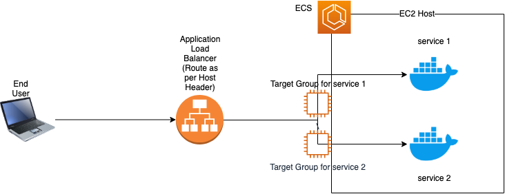
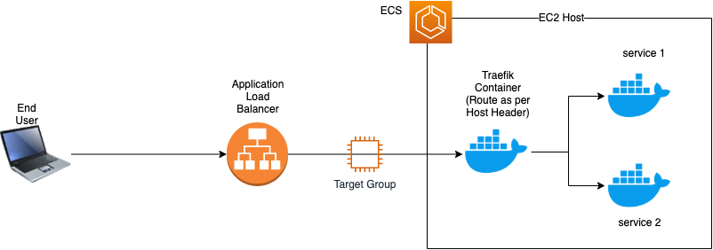
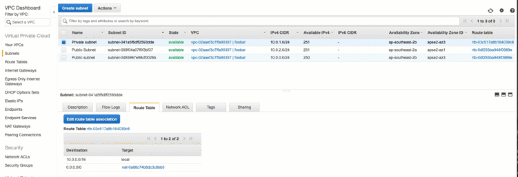
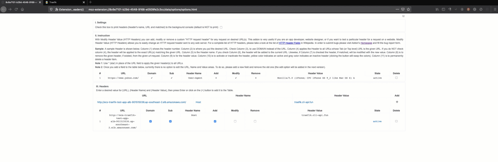

## Traefik ECS Demo

## What are we up to?
We will use [Traefik](https://containo.us/traefik/) to proxy incoming requests based on `Host` headers to the ECS Services.

Don't judge me on code quality :). I've purposefully not used `https`, `301` redirection and other fancy stuff as this demo is to just to show the capability of traefik to proxy requests in an AWS ECS environment.

## Why not just ALB?

[ALB](https://docs.aws.amazon.com/elasticloadbalancing/latest/application/introduction.html) can definitely do the job but needs more efforts (either manual or custom some automation). To use a common ALB (and save costs), for every service one needs create a target group, ALB rule, and refer those in the service definition.
Remember you need to manage the lifecycle of the service i.e. create and delete corresponding resources when you create or delete a service.




## Why Traefik?
Traefik takes the overhead of managing multiple target groups and rules for each and every service in ALB, and we just need one ALB and target group. Why do the work when Traefik is here :)
Traefik adds and deletes are virtual hosts for each service automagically.

Traefik does the redirection (to the upstream services) based on a `Host` header. In my example, I am running it in `DAEMON` mode i.e. one per host.



*NOTE*: I am deliberately using Traefik v1 and not v2 as there is no ECS provider for v2 yet. This should not discourage anyone as v1 is still being updated (or bug fixed). For all other purpose, please use v2. You can thank me later :)

## Pre-Requsities
* Basic knowlegde on AWS and EC2 Container Service (ECS)
* Terraform 0.12.X
* Export AWS Region and Credentials exported (i.e. `AWS_PROFILE` variable)
    ```bash
    export AWS_PROFILE=traefik-ecs-test
    export AWS_DEFAULT_REGION=ap-southeast-2
    ```
* Create a VPC with two public subnets and one private subnet as shown [here](https://docs.aws.amazon.com/batch/latest/userguide/create-public-private-vpc.html). Choose all defaults:
    * VPC CIDR: 10.0.0.0/16
    * Public Subnets: 10.0.0.0/24, 10.0.2.0/24
    * Private Subnet: 10.0.1.0/24

    You routes should be similar to this
        

## Let's Do It !
* Create a docker image (on top of official Traefik image) and store it in ECR (of the same AWS Account)
    ```bash
    ./files/scripts/traefik-image.sh
    ```
    Note: The fifth line in the script where I am replacing two variables `$CLUSTER_HOST` and `$DOMAIN`. These are the ones which I have in the ECS task definition of Traefik. It just helps to avoid hard coding stuff in the repository.

* Initialize Terraform
    ```bash
    terraform init
    ```

* (Optional) See what resources we are going to create
    ```bash
    terraform plan -var-file=./ecs-demo.tfvars
    ```

* Create ECS Cluster
    ```bash
    terraform apply -var-file=./ecs-demo.tfvars -auto-approve
    ```
    The above command will create an ECS cluster, Public ALB and three ECS Tasks
    * Traefik
    * Sample Tasks 1
    * Sample Task 2
    Also, it will create a file `output.txt` in the current directory


### Check if everything is working as expected
* Check the commands shown in `output.txt`
    ```bash
    cat output.txt
    ```

* Traefik Test: Services and Dashboard (through curl)
    ```bash
    🍺  ~$ curl -H 'Host: traefik.cli-api.fun' ecs-traefik-test-app-alb-901515036.ap-southeast-2.elb.amazonaws.com
    <a href="/dashboard/">Found</a>.
    🍺  ~$

    🍺  ~$ curl -H 'Host: site-counter-1.cli-api.fun' ecs-traefik-test-app-alb-901515036.ap-southeast-2.elb.amazonaws.com
    aa808ed5b427  -  [172.17.0.3]  -  View Count:  1
    🍺  ~$

    🍺  ~$ curl -H 'Host: site-counter-2.cli-api.fun' ecs-traefik-test-app-alb-901515036.ap-southeast-2.elb.amazonaws.com
    43059b30a193  -  View Count:  1
    🍺  ~$
    ```

* Create a CNAME (or an Route53 Alias) which points to the DNS of ALB
For example, it could be `traefik.cli-api.fun`

* Alternatively, just use a firefox [extension](https://mybrowseraddon.com/modify-header-value.html) to fake the host header in the browser.
    You should have something like this
        

## Nuke Everything
- ECS cluster and resources using Terraform
    ```bash
    terraform destroy -var-file=./ecs-demo.tfvars -force
    ```
- From the AWS Console, we just need to remove resources which we had created earlier. Double check the VPC ID :)
    * Delete the NAT Gateway
    * Release Elastic IP
    * Delete VPC
    * Delete ECR Docker Repository traefik

## References
* https://docs.traefik.io/v1.7/configuration/backends/ecs/

## Alternatives
There are a few alternatives but I have not tried these out.
* AWS [Route53](https://docs.aws.amazon.com/AmazonECS/latest/developerguide/service-discovery.html)
* Hashicorp Consul

## Questions/Issues:
If you a suggestion to simplify this demo further for newbies, feel free to raise a PR or create an issue.

## Finally
Traefik is awesome, I absolutely love it. Traefik is my goto reverse proxy on Kubernetes, Docker, or even when I need static files. Traefik v2 (a complete overhaul) is awesome too, and works beautifully on Kubernetes. Try it out :)
